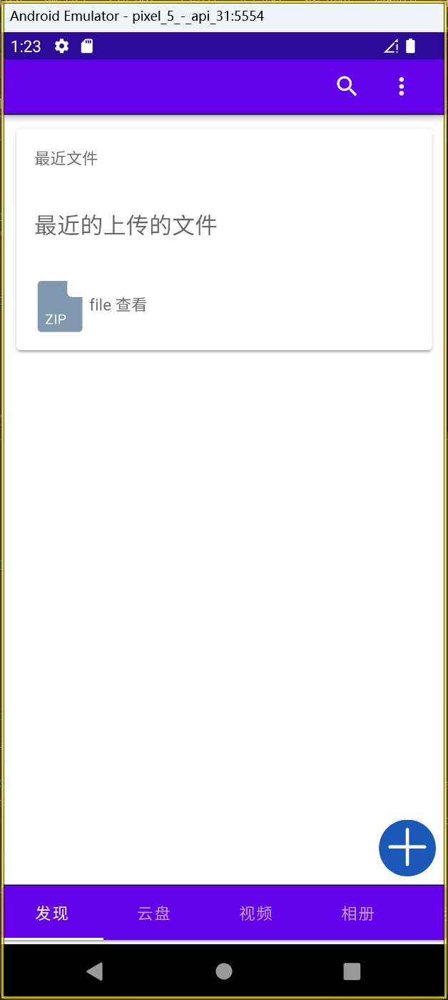

## 介绍
云盘系统客户端
使用MAUI实现跨平台客户端
目前还在维护中

## 软件架构
技术实现：
[MAUI Blazor](https://docs.microsoft.com/zh-cn/dotnet/maui/what-is-maui) + [MASA Blazor的UI框架](https://masa-blazor-docs-dev.lonsid.cn/)
[服务端](https://github.com/239573049/cloud-storage)

## 软件运行图

